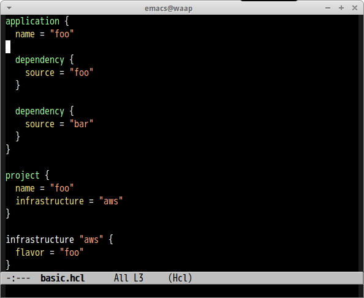

# hcl-mode

Major mode of [Hashicorp Configuration Language](https://github.com/hashicorp/hcl)


## Screenshot




## Features

- Syntax highlighting
- Indentation


## Customize Variables

#### `hcl-indent-level`(Default: `2`)

Indentation size


## Sample Configuration

```lisp
(custom-set-variables
 '(hcl-indent-level 4))
```
